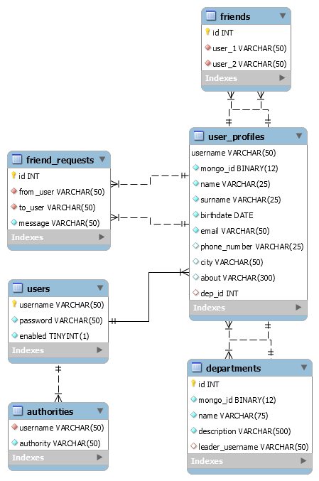
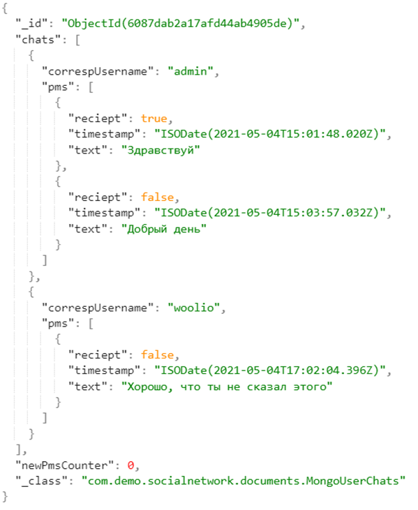

# Прототип закрытой социальной сети 

Демонстрационный прототип закрытой социальной сети, решающей задачу коммуникации сотрудников в границах единой корпоративной среды. 
Для хранения данных была использована парадигма polyglot persistence и создана многовариантная модель, включающая реляционную базу данных на основе MySQL и документо-ориентированную базу данных с использованием СУБД MongoDB. В реляционную модель были внесены данные, требующие жесткой структуры и схемы, имеющие высокие требования к целостности и безопасности. Документо-ориентированная модель создавалась для данных с нежесткой схемой, которые эффективнее хранить в качестве агрегатов.
Для полноценной работы социальной сети были созданы три роли, обладающие различными привилегиями: роли рядового сотрудника, руководителя отдела и администратора. 
В ходе разработки ОМДП было создано 6 реляционных таблиц и 2 коллекции документов. 
В результате проделанной работы по разработке веб-приложения было создано:
•	29 сервлетов, обслуживающих HTTP запросы;
•	14 веб-страниц для взаимодействия с пользователями;
•	4 интерфейса @Service (22 метода) для взаимодействия с базой данных на уровне сервера.

## Технологии
- Spring Boot, Spring MVC, Spirng Secutiry, Spring Data
- Hibernate
- Maven
- JSP, JSTL
- MySQL, MongoDB

## 

